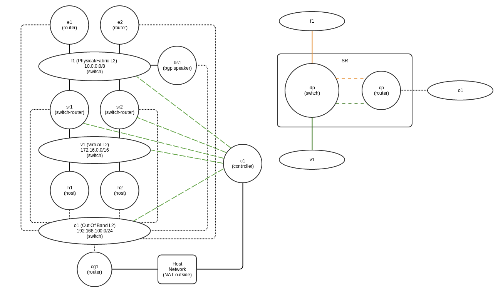

# Minilab: SDN network simulator

Introduction
------------

Minilab is a mininet library extension allowing simple setup and tests of complex network topologies.

A new node class ManageableHost provides a basic pseudo container (network namespace + chrooted ssh) node type that can be manageable directly or with ansible.

Topologies are defined in yaml files (see examples/lab1/config.yaml).

Requirements
------------

- mininet
- openvswitch
- python libraries
    - py2-ipaddress
    - pyyaml
    - jinja2

If you want to use ManageableHost class:

- linux kernel with overlaysfs support (>= 3.18)

If you want to be able to NAT your network:

- kernel with iptables support

Installation
------------

Install packages on debian/ubuntu systems (tested on ubuntu >= 14.04):

    apt-get install iptables git mininet python-pip python-jinja2 python-yaml python-pip 

Install python2 ipaddress library :

    pip install py2-ipaddress

Install minilab code :

    git clone https://github.com/ericgarrigues/minilab.git

The simple/auto way :

    cd minilab
    sudo ./setup_mlenv.sh

The hard/manual way (needed only if you want to use manageable hosts):

If you want manageable hosts you will need a base rootfs 

wget http://cdimage.ubuntu.com/ubuntu-core/releases/14.04/release/ubuntu-core-14.04.3-core-amd64.tar.gz
tar -zxvf ubuntu-core-14.04.3-core-amd64.tar.gz -C rootfs/

...

Start minilab
-------------

    sudo python minilab.py TOPOLOGY_FILE

Test with ryu controller
------------------------

Connect remotely into the manageable hosts through ssh
------------------------------------------------------

Example topology 
----------------

TODO
----

- remove dependancy on py-ipaddress
- split the single configuration file into minilab config and topology description files

