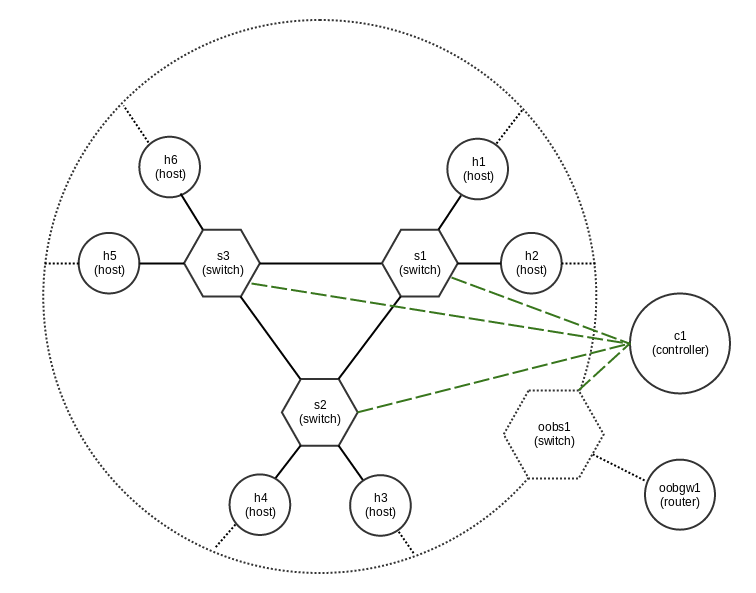

# Minilab: SDN network simulator

Introduction
------------

Minilab is a mininet library extension allowing simple setup and tests of
complex network topologies.

A new node class ManageableHost provides a basic pseudo container (network
namespace + chrooted ssh) node type that can be manageable directly or with
ansible.

Topologies are defined in yaml files (see examples/loop/topo.yaml).


Requirements
------------

- mininet
- openvswitch
- python libraries
    - py2-ipaddress
    - pyyaml
    - jinja2

If you want to use ManageableHost class:

- linux kernel with overlaysfs support (>= 3.18)

If you want to be able to NAT your network:

- kernel with iptables support


#### Openflow controller

It is today required to have a remote (can be on same host) openflow controller
for spawned switches which, in my opinion, is the most frequent use of
minilab/mininet.

I recommand ryu or opendaylight controllers as they are both well supported.

For ryu installation : http://osrg.github.io/ryu/

For opendaylight installation : https://www.opendaylight.org/


Installation
------------

Install packages on debian/ubuntu systems (tested on ubuntu >= 14.04):

    apt-get install iptables git mininet python-pip python-jinja2 python-yaml python-pip

Install python2 ipaddress library :

    pip install py2-ipaddress

Install minilab code :

    git clone https://github.com/ericgarrigues/minilab.git

Setup your minilab env :

The simple/auto way with ubuntu 14.04 as distribution for manageable hosts:

    cd minilab
    sudo ./setup_mlenv.sh


Minilab configuration
---------------------

Minilab configuration files are written in yaml.

### General configuration

By default the configuration is in the minilab directory and is named
config.yaml.

You can specify another configuration file with the **--config** minilab runtime
 argument.

Base configuration :

```
# minilab configuration file
minilab_dir: "/var/minilab"
root_fs: "/var/minilab/rootfs"
ssh:
    template: "sshd_config.j2"
    tmpl_dir: "templates"
    authorized_keys: "~/.ssh/id_rsa_lab.pub"
```

### Topology configuration

Topology files contain controllers, switches, hosts and links configurations.

```
# sample configuration
nat:
    node:
        name: ogw1
        ip: "192.168.100.254/24"
    switch:
        name: o1
    ext_iface: eth0
controllers:
    - name: ryu
      ip: 127.0.0.1
      port: 6653
switches:
    - name: s1
      dpid: "0000000000000001"
    - name: s2
      dpid: "0000000000000002"
      links:
          - s1
    - name: s3
      dpid: "0000000000000003"
      links:
          - s1
          - s2
    - name: o1
      dpid: "0000000000000004"
hosts:
    - name: h1
      is_manageable: True
      gw: 192.168.100.254
      links:
          - sw: s1
            ip: "172.16.0.1/16"
          - sw: o1
            ip: "192.168.100.1/24"
    - name: h2
      is_manageable: True
      gw: 192.168.100.254
      links:
          - sw: s2
            ip: "172.16.0.2/16"
          - sw: o1
            ip: "192.168.100.2/24"
    - name: h3
      is_manageable: True
      gw: 192.168.100.254
      links:
          - sw: v1
            ip: "172.16.0.3/16"
          - sw: o1
            ip: "192.168.100.3/24"
```

Test with minimal ryu controller configuration
----------------------------------------------

A simple ryu configuration file is provided in the **extras/ryu** directory of
the project.

It can be used to test the **loop** sample minilab topology.

#### Ryu installation

Fetch ryu code:
```
git clone https://github.com/osrg/ryu.git
```

I strongly suggest that you create a virtualenv to run ryu and install all its
dependancies.
```
apt-get install python-virtualenv
```

Then create and enter the virtualenv
```
virtualenv ryuvenv
source ryuvenv/bin/activate
```

Install ryu and its dependancies

```
cd ryu
pip install -r tools/pip-requires
python setup.py install
```

Note: on ubuntu 14.04, if you don't create a virtualenv, you will have a
version problem between previously installed six (dependancy of python-pip
package) and the version ryu required.

You can upgrade the six version ryu required with :

```
pip install six --upgrade
```

#### Start ryu with the minilab configuration

```
ryu-manager --config-file ~/minilab/extras/ryu.conf
```

Testing the example loop topology
---------------------------------

The sample loop topology defined in **examples/loop/topo.yaml** create the
following network :



- 3 inter-connected **in-band** switches.
- 1 **out-of-band** switch
- 6 hosts
    - each connected to one switch and the out-of-band switch
- 1 out-of-band router
    - connected the oob network to the host network
    - nating the oob network to the outside


To setup and start :

```
cd minilab
root@minilab2:~/minilab# python minilab.py examples/loop/topo.yaml
*** Adding controller
*** Adding switches
*** Adding hosts
*** Mounting filesystem for h1
*** Mounting filesystem for h2
*** Mounting filesystem for h3
*** Mounting filesystem for h4
*** Mounting filesystem for h5
*** Mounting filesystem for h6
*** Setup nat gateway node
*** Starting nat
*** Starting ssh server on h1
*** Starting ssh server on h2
*** Starting ssh server on h3
*** Starting ssh server on h4
*** Starting ssh server on h5
*** Starting ssh server on h6
*** Starting network
*** Configuring hosts
h1 h2 h3 h4 h5 h6
*** Starting controller
*** Starting 4 switches
s1 s2 s3 oobs1
*** Starting CLI
*** Starting CLI:
mininet>
```

Deploying code to ManageableHosts with ansible
----------------------------------------------

The main purpose of the ManageableHost node class is to provide a pseudo
container with its own files that is accessible via ssh, which make it a good
target for ssh-based deployment tools like ansible.

The dynamic inventory script **lab_inventory.py**, provided in the
**extras/ansible** directory, can be used by ansible to access manageable
hosts defined in the topology file.

The environment variable **TOPOLOGY** must be defined and pointing on your
topology configuration file.

Also, if you want some variables to be accessible into ansible from your
topology file, just add **ansible_vars** dictionaries to your host definitions.

**ansible_group** host variable is used to put an host in an ansible group at
runtime.

Extract from topology with ansible variables declared :

```
...
hosts:
    - name: h1
      is_manageable: True
      gw: 192.168.100.254
      links:
          - sw: v1
            ip: "172.16.0.1/16"
          - sw: o1
            ip: "192.168.100.1/24"
      ansible_group: customers
      ansible_vars:
            database: my_database
            broker: 127.0.0.1
    - name: e1
      is_manageable: True
      gw: 192.168.100.254
      links:
          - sw: f1
            ip: "10.0.0.1/8"
          - sw: o1
            ip: "192.168.100.252/24"
      ansible_group: routers
      ansible_vars:
            database: my_database
            broker: 127.0.0.1
    - name: sp1
      is_manageable: True
      gw: 192.168.100.254
      links:
          - sw: f1
            ip: "10.0.0.10/8"
          - sw: o1
            ip: "192.168.100.100/24"
      ansible_group: speakers
      ansible_vars:
          database: my_database
          broker: 127.0.0.1
...
```

Example : play the sample playbook deploying lldpd

```
export TOPOLOGY=/root/minilab/examples/loop/topo.yaml
cd minilab
ansible-playbook -i extras/ansible/lab_inventory.py example/loop/ansible/playbook.yaml

```

SSH configuration for remote access
-----------------------------------

You can easily access your hosts with a simple ssh configuration (~/.ssh/config)
 like this:

```
Host minilab
    user root
    Hostname my.minilab.host
    IdentityFile ~/.ssh/my_ssh_key

Host 192.168.100.*
    user root
    ServerAliveInterval    60
    TCPKeepAlive           yes
    ProxyCommand           ssh -q -A root@minilab nc %h %p
    ControlMaster          auto
    ControlPath            ~/.ssh/mux-%r@%h:%p
    ControlPersist         8h
    User                   root
```

Your public ssh key must be present in your /root/.ssh/authorized_keys of the
minilab host.

Hosting minilab in Gandi (service provider i work for)
------------------------------------------------------

TO WRITE

TODO
----

- remove dependancy on py-ipaddress
- refactor host groups and ansible vars
